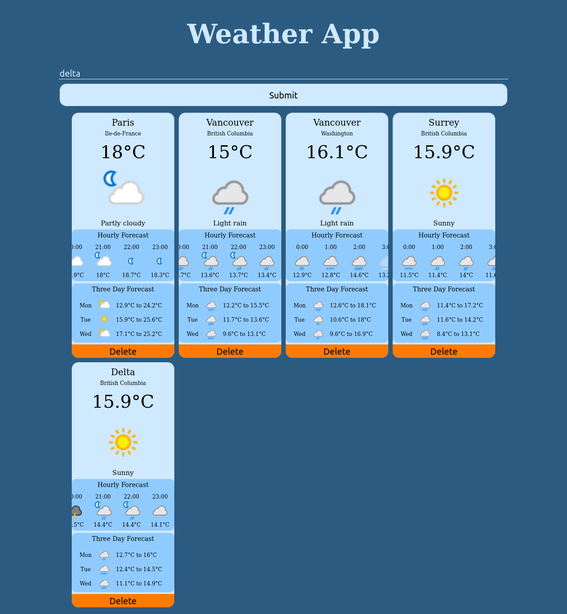

# WeatherApp
This app pulls data from 'https://rapidapi.com/weatherapi/api/weatherapi-com'. Create a file called apiKey.js in the same format as apiKeyExample.js, and then use the api key from this rapidapi link (You will need to login to rapid api to get a key).

To setup the app through Apache, clone the repository to /var/www. Then create a file named WeatherApp.conf in /etc/apache2/sites-available/. Set the ServerName to WeatherApp and the DocumentRoot to /var/www/WeatherApp. Then activate the file (sudo a2ensite WeatherApp.conf) and restart Apache (systemctl restart apache2). Finally, Add the line 'LOCAL_IP WeatherApp' to /etc/hosts (where LOCAL_IP is your local ipv4 address). You can now get to the app with the url 'http://weatherapp'.

To use the app, type a city name in the input box. A region can also be added to specify if there are multiple cities with the same name. If no region is added, then the most prominent city of its namesake will be chosen. If a city that has already been submitted gets submitted again, it will give a warning and prevent a second instance of that location from showing up in the app.

For example, if "Vancouver" is submitted, then the weather forecast for "Vancouver, BC" will show up. If "Vancouver" is submitted again, a warning will show up. If "Vancouver, Washington" is submitted, then the weather forecast for "Vancouver, Washington" will show up next to "Vancouver, BC".

The weather forecast for a location will show the current temperature and the current weather state (sunny, light rain, fog, etc.), as well as an hourly forecast and a three day forecast. The instance for a location can also be deleted so that it won't clutter up the page.

